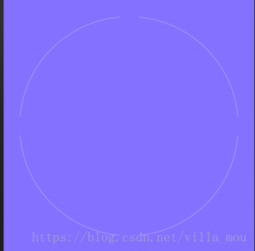
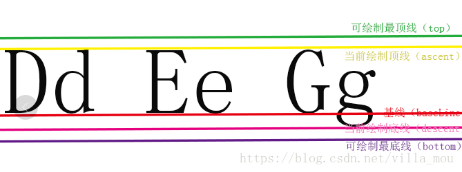
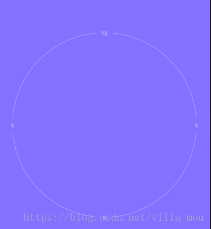
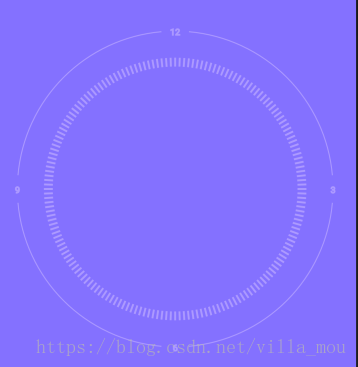
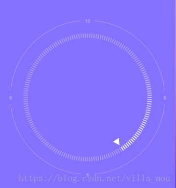
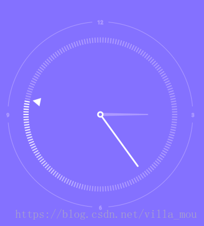
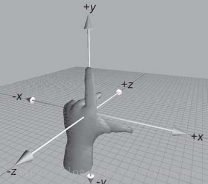

### 引言
今天玩小米mix2的时候看到了小米的时间控件效果真的很棒。有各种动画效果，3d触摸效果，然后就想着自己能不能也实现一个这样的时间控件，那就开始行动绘制一个简易版本的小米时间控件吧o((≧▽≦o)
### 效果图

* 首先来看看小米的效果是这个样子的


* 再来看看我的效果


  
### 具体实现过程
我们都知道自定控件的绘制有很多种，继承view，继承viewgroup，还有继承已有的控件，但是无非就几个步骤：

* measure(): 测量,用来控制控件的大小,final 不建议复写
* layout(): 布局，用来控制控件摆放的位置,继承view不需要
* draw(): 绘制，用来控制控件的样子
* ontouch();touch事件


其中最重要的就是draw()方法，这个3d触摸效果是采用了Camera与Matrix现实，话不多说，开始理一下自己绘制的思路，我设想的绘制思路如下：

*  1，先画最外层的圆弧和文字
*  2，再画里面刻度盘
*  3，再画秒表三角形
*  4，画时针和分针
*  5，画中间小球
*  6，3d触摸效果

既然思路已经明确了，二话不说，那就开始搞吧


#### **绘制前的准备工作**
首先需要初始化各种画笔，kotlin提供了一个init方法，就是拿来初始化的，不用像以前那样每个构造够一个init方法了，简单快捷 

```
init {
        mPaintOutCircle.color = color_halfWhite
        mPaintOutCircle.strokeWidth = dp2px(1f)
        mPaintOutCircle.style = Paint.Style.STROKE

        mPaintOutText.color = color_halfWhite
        mPaintOutText.strokeWidth = dp2px(1f)
        mPaintOutText.style = Paint.Style.STROKE
        mPaintOutText.textSize = sp2px(10f).toFloat()
        mPaintOutText.textAlign = Paint.Align.CENTER

        mPaintProgressBg.color = color_halfWhite
        mPaintProgressBg.strokeWidth = dp2px(2f)
        mPaintProgressBg.style = Paint.Style.STROKE

        mPaintProgress.color = color_halfWhite
        mPaintProgress.strokeWidth = dp2px(2f)
        mPaintProgress.style = Paint.Style.STROKE

        mPaintTriangle.color = color_white
        mPaintTriangle.style = Paint.Style.FILL

        mPaintHour.color = color_halfWhite
        mPaintHour.style = Paint.Style.FILL

        mPaintMinute.color = color_white
        mPaintMinute.strokeWidth = dp2px(3f)
        mPaintMinute.style = Paint.Style.STROKE
        mPaintMinute.strokeCap = Paint.Cap.ROUND

        mPaintBall.color = Color.parseColor("#836FFF")
        mPaintBall.style = Paint.Style.FILL
    }
```
接下来我们来看一下onmeasure方法，这个是测量控件的方法，一般情况下我们是不需要复写的，但是这个是个**正方形**的控件，所以是需要复写的，不能随便设置宽高，宽高需要保持一致；来看下代码

```
    override fun onMeasure(widthMeasureSpec: Int, heightMeasureSpec: Int) {
        val width = View.MeasureSpec.getSize(widthMeasureSpec)
        val height = View.MeasureSpec.getSize(heightMeasureSpec)
        //设置为正方形
        val imageSize = if (width < height) width else height
        setMeasuredDimension(imageSize, imageSize)
    }
```
然后我们就开始绘制了，就复写ondraw方法就行了，在绘制之前我们需要把cavans画板平移到view的中心，这样有利于下面绘制时候的旋转绘制，这里说明一下，我采用的是**旋转画布**的绘制方式，当然你也可以采用**三角函数进行计算具体的位置进行绘制**，道理差不多，我只是觉得计算麻烦一点；

我们来看一下实现，首先需要在onSizeChanged（）方法拿到宽高，这个方法调用的时候代表已经测量结束，所以是可以拿到宽高的；

```
  override fun onSizeChanged(w: Int, h: Int, oldw: Int, oldh: Int) {
        super.onSizeChanged(w, h, oldw, oldh)
        mWidth = w
        mHeight = h
        mCenterX = mWidth / 2
        mCenterY = mHeight / 2
    }

```
然后画布平移

```
   override fun onDraw(canvas: Canvas) {
        //平移到视图中心
        canvas.translate(mCenterX.toFloat(), mCenterY.toFloat())
    }
```
好了绘制前的准备工作已经做好了接下来开始进行绘制

#### **绘制外边缘4个弧度**
按照我之前的绘制思路，已经是首先绘制外边缘的4个弧度，每个弧度我设置为80°，弧度的位置分别是是
 **5-85,95-175,185 -265,275-355；**

```
    private fun drawArcCircle(canvas: Canvas) {
        val min = Math.min(width, mHeight)
        val rect = RectF(-(min - paddingOut) / 2, -(min - paddingOut) / 2, (min - paddingOut) / 2, (min - paddingOut) / 2)
        canvas.drawArc(rect, 5f, 80f, false, mPaintOutCircle)
        canvas.drawArc(rect, 95f, 80f, false, mPaintOutCircle)
        canvas.drawArc(rect, 185f, 80f, false, mPaintOutCircle)
        canvas.drawArc(rect, 275f, 80f, false, mPaintOutCircle)

    }
```
看下效果



#### **绘制外边缘4个文字**
然后绘制4个文字刻度：3,6,9,12，文字绘制主要是要把握到文字的具体位置，这里还是有点麻烦滴，你要知道具体的文字画笔几个属性是什么意思，如下图


  
上代码
```
private fun drawOutText(canvas: Canvas) {
        val min = Math.min(width, mHeight)
        val textRadius = (min - paddingOut) / 2
        val fm = mPaintOutText.getFontMetrics()
        //文字的高度
        val mTxtHeight = Math.ceil((fm.leading - fm.ascent).toDouble()).toInt()
        canvas.drawText("3", textRadius, (mTxtHeight / 2).toFloat(), mPaintOutText)
        canvas.drawText("9", -textRadius, (mTxtHeight / 2).toFloat(), mPaintOutText)
        canvas.drawText("6", 0f, textRadius + mTxtHeight / 2, mPaintOutText)
        canvas.drawText("12", 0f, -textRadius + mTxtHeight / 2, mPaintOutText)
    }
```
效果图



#### **绘制刻度**
刻度就很简单了，每个2°绘制一个刻度，也就是有180个刻度

```
  private fun drawCalibrationLine(canvas: Canvas) {
        val min = Math.min(width, mHeight) / 2
        for (i in 0 until 360 step 2) {
            canvas.save()
            canvas.rotate(i.toFloat())
            canvas.drawLine(min.toFloat() * 3 / 4, 0f, min * 3 / 4 + dp2px(10f), 0f, mPaintProgressBg);
            canvas.restore()
        }
    }
```
如图



#### **绘制秒**
这个是最有难度的一个地方，三角形通过旋转画布实现，知道秒表走的角度就可以了

```
   private fun drawSecond(canvas: Canvas) {
        //先绘制秒针的三角形
        canvas.save()
        canvas.rotate(mSecondMillsDegress)
        val path = Path()
        path.moveTo(0f, -width * 3f / 8 + dp2px(5f))
        path.lineTo(dp2px(8f), -width * 3f / 8 + dp2px(20f))
        path.lineTo(-dp2px(8f), -width * 3f / 8 + dp2px(20f))
        path.close()
        canvas.drawPath(path, mPaintTriangle)
        canvas.restore()

        //绘制渐变刻度
        val min = Math.min(width, mHeight) / 2
        for (i in 0..90 step 2) {
            //第一个参数设置透明度，实现渐变效果，从255到0
            canvas.save()
            mPaintProgress.setARGB((255 - 2.7 * i).toInt(), 255, 255, 255)

            //这里的先减去90°，是为了旋转到开始角度，因为开始角度是y轴的负方向
            canvas.rotate(((mSecondDegress - 90 - i).toFloat()))
            canvas.drawLine(min.toFloat() * 3 / 4, 0f, min * 3 / 4 + dp2px(10f), 0f, mPaintProgress);
            canvas.restore()
        }
    }
```
如图



#### **绘制分针和时针**
分针是一阶贝塞尔就是画线，时针是画path，也是旋转角度，这两个都差不多，就是绘制path

```
   private fun drawMinute(canvas: Canvas) {
        canvas.save()
        canvas.rotate(mMinuteDegress.toFloat())
        canvas.drawLine(0f, 0f, 0f, -(width / 3).toFloat(), mPaintMinute)
        canvas.restore()
    }

    private fun drawHour(canvas: Canvas) {
        canvas.save()
        canvas.rotate(mHourDegress.toFloat())
        canvas.drawCircle(0f, 0f, innerRadius, mPaintTriangle)
        val path = Path()
        path.moveTo(-innerRadius / 2, 0f)
        path.lineTo(innerRadius / 2, 0f)
        path.lineTo(innerRadius / 6, -(width / 4).toFloat())
        path.lineTo(-innerRadius / 6, -(width / 4).toFloat())
        path.close()
        canvas.drawPath(path, mPaintHour)
        canvas.restore()
    }
```
#### **绘制中间小球**

这个就不用多说了
```
  private fun drawBall(canvas: Canvas) {
        canvas.drawCircle(0f, 0f, innerRadius / 2, mPaintBall)

    }
```
绘制就结束了，接下来是如何让时间走起来
如图



#### **让时间走起来**

我才用的方法就是直接采用延时任务的方式，每隔150毫秒去刷新一次时间数据
首先要获取到具体的当前时间数据

```
  private fun calculateDegree() {
        val mCalendar = Calendar.getInstance()
        mCalendar.timeInMillis = System.currentTimeMillis()
        val minute = mCalendar.get(Calendar.MINUTE)
        val secondMills = mCalendar.get(Calendar.MILLISECOND)
        val second = mCalendar.get(Calendar.SECOND)
        val hour = mCalendar.get(Calendar.HOUR)
        mHourDegress = hour * 30
        mMinuteDegress = minute * 6
        mSecondMillsDegress = second * 6 + secondMills * 0.006f
        mSecondDegress = second * 6
        val mills = secondMills * 0.006f
        //因为是没2°旋转一个刻度，所以这里要根据毫秒值来进行计算
        when (mills) {
            in 2 until 4 -> {
                mSecondDegress +=2
            }
            in 4 until 6 -> {
                mSecondDegress += 4
            }
        }
    }

```
然后开始运动

```
 // 指针转动的方法
    fun startTick() {
        // 一秒钟刷新一次
        postDelayed(mRunnable, 150)
    }

    private val mRunnable = Runnable {
        calculateDegree()
        invalidate()
        startTick()
    }
```
最后跟window进行视图绑定

```

    /**
     * 调用时机：onAttachedToWindow是在第一次onDraw前调用的,只调用一次
     */
    override fun onAttachedToWindow() {
        super.onAttachedToWindow()
        startTick()
    }

    /**
     * 调用时机：我们销毁View的时候。我们写的这个View不再显示。
     */
    override fun onDetachedFromWindow() {
        super.onDetachedFromWindow()
        removeCallbacks(mRunnable)
    }

```
#### **3d触效果**
3d效果主要涉及到两个类

```
一个是android.graphics.Camera:3D开发，不是android.hardware.Camera:别倒错包了
还有一个是矩阵Matrix
```
一个照相机实例可以被用于计算3D变换，生成一个可以被使用的Matrix矩阵，一个实例，用在画布上。
其实Camera内部机制实际上还是opengl，只不过大大简化了使用。这样有利于开发者进行开发

Camera的坐标系是左手坐标系。当手机平整的放在桌面上，X轴是手机的水平方向，Y轴是手机的竖直方向，Z轴是垂直于手机向里的那个方向。




这个控件首先要touch事件中获取到具体的旋转角度，也就是说我们在触摸的时候计算出我们需要旋转的角度，然后设置给camera，然后camera在设置给Matrix，最后关联cavans

主要代码([部分代码参考自定义View练习（五）高仿小米时钟](https://blog.csdn.net/qq_31715429/article/details/54668668))

```
    private fun setCameraRotate() {
        mCameraMatrix.reset()
        mCamera.save()
        mCamera.rotateX(mCameraRotateX)//绕x轴旋转角度
        mCamera.rotateY(mCameraRotateY)//绕y轴旋转角度
        mCamera.getMatrix(mCameraMatrix)//相关属性设置到matrix中
        mCamera.restore()
        mCanvas.concat(mCameraMatrix)//matrix与canvas相关联
    }
```

touch事件的处理

```
    override fun onTouchEvent(event: MotionEvent): Boolean {
        when (event.action) {
            MotionEvent.ACTION_DOWN -> {
                mShakeAnim?.let {
                    if (it.isRunning) {
                        it.cancel()
                    }
                }
                getCameraRotate(event)
                getCanvasTranslate(event)
            }
            MotionEvent.ACTION_MOVE -> {
                //根据手指坐标计算camera应该旋转的大小
                getCameraRotate(event)
                getCanvasTranslate(event)
            }
            MotionEvent.ACTION_UP ->
                //松开手指，时钟复原并伴随晃动动画
                startShakeAnim()
        }
        return true
    }
```

```
 private fun getCameraRotate(event: MotionEvent) {
        val rotateX = -(event.y - height / 2)
        val rotateY = event.x - width / 2
        //求出此时旋转的大小与半径之比
        val percentArr = getPercent(rotateX, rotateY)
        //最终旋转的大小按比例匀称改变
        mCameraRotateX = percentArr[0] * mMaxCameraRotate
        mCameraRotateY = percentArr[1] * mMaxCameraRotate
    }

    /**
     * 当拨动时钟时，会发现时针、分针、秒针和刻度盘会有一个较小的偏移量，形成近大远小的立体偏移效果
     * 一开始我打算使用 matrix 和 camera 的 mCamera.translate(x, y, z) 方法改变 z 的值
     */
    private fun getCanvasTranslate(event: MotionEvent) {
        val translateX = event.x - width / 2
        val translateY = event.y - height / 2
        //求出此时位移的大小与半径之比
        val percentArr = getPercent(translateX, translateY)
        //最终位移的大小按比例匀称改变
        mCanvasTranslateX = percentArr[0] * mMaxCanvasTranslate
        mCanvasTranslateY = percentArr[1] * mMaxCanvasTranslate
    }
        /**
     * 获取一个操作旋转或位移大小的比例
     * @return 装有xy比例的float数组
     */
    private fun getPercent(x: Float, y: Float): FloatArray {
        val percentArr = FloatArray(2)
        var percentX = x / mRadius
        var percentY = y / mRadius
        if (percentX > 1) {
            percentX = 1f
        } else if (percentX < -1) {
            percentX = -1f
        }
        if (percentY > 1) {
            percentY = 1f
        } else if (percentY < -1) {
            percentY = -1f
        }
        percentArr[0] = percentX
        percentArr[1] = percentY
        return percentArr
    }
```

就这样一个小米时间控件绘制完成了
当然我也传了一个demo到github，如果有需要可以去下载玩玩
地址：[github地址](https://github.com/mouxuefei/MIClockView)

如果大家喜欢,请关注我的公众号,感谢大家支持,地址如下:


